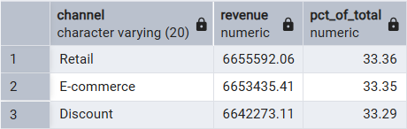
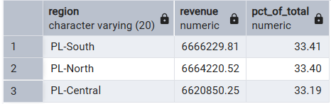

# FMCG-Sales-Performance-Report-2022-2024

Table of Contents

- [Project Background](#project-background)
- [Executive Summary](#executive-summary)
- [Data Structure](#data-structure)
- [Insights Deep-Dive](#insights-deep-dive)
    - [Sale Trends Insights](#sale-trends-insights)
    - [Product Performance](#product-performance)
    - [Promotional Performance](#promotional-performance)
    - [Channel Trends and Performance](#channel-trends-and-performance)
    - [Regional Trends and Performance](#regional-trends-and-performance)
- [Recommendations](#recommendations)
- [Assumptions and Caveats](#assumptions-and-caveats)

***

## Project Background

This project analyzes sales of Fast-Moving Consumer Goods for the year 2022 to 2024, with 190,757 rows in total. The daily business transaction within product categories such as sales, channel, and regions are recorded. The data is reflecting of an actual business operation such as the leading operating in the business of consumer goods such as Nestlé, Unilever, or P&G. The overall objective of the project is to uncover sales drivers, category performance, impact of promotion, and channel/regional contribution, and provide results that would aid the sales, product, and marketing teams.

Download the interactive Power BI dashboard [here](https://github.com/dev-cass/FMCG-Sales-Performance-Report-2022-2024/blob/530559b68ac2fb36facd90747a14ef4488e80852/FMCG_Dashboard.pbix)

View SQL data importing queries [here.](https://github.com/dev-cass/FMCG-Sales-Performance-Report-2022-2024/blob/530559b68ac2fb36facd90747a14ef4488e80852/SQL/data_importing.sql)

View SQL quality check queries [here.](https://github.com/dev-cass/FMCG-Sales-Performance-Report-2022-2024/blob/530559b68ac2fb36facd90747a14ef4488e80852/SQL/initial_data_check.sql)

View SQL data cleaning queries [here.](https://github.com/dev-cass/FMCG-Sales-Performance-Report-2022-2024/blob/530559b68ac2fb36facd90747a14ef4488e80852/SQL/data_cleaning.sql)

Explore business-focused SQL queries [here.](https://github.com/dev-cass/FMCG-Sales-Performance-Report-2022-2024/blob/530559b68ac2fb36facd90747a14ef4488e80852/SQL/exploratory_data_analysis(EDA).sql)

## Executive Summary

From 2022–2024, the FMCG (Fast-Moving Consumer Goods) sales peaked at $891K in July 2023, driven by a new yogurt SKU (YO-024). Yogurt remains the core sales of the business (~40% of revenue) but is gradually shrinking, while Snack Bars are the fastest-growing segment. Year-over-year, order count rose 8.3%, yet total revenue declined slightly by 1.05%, reflecting an 8.6% drop in Average Order Value (AOV), indicating higher transaction volume but lower revenue per order. Non-promotional sales drove $14.8M in revenue, while promotions effectively increased order value. Retail remains the top channel overall, though E-commerce slightly outpaced other channels in 2023–2024, indicating a gradual shift toward online sales. Regionally, PL-South overtook PL-North in 2023, which shows how a new product launches can reshape the market dynamics.

## Data Structure
`date` – Transaction date of the sale.  

`sku` – Unique identifier for each product.  

`brand` – Manufacturer of the product.  

`segment` – Sub-category of the product.  

`category` – Higher-level grouping of products.  

`channel` – Sales channel (Retail, Discount, E-commerce).  

`region` – Geographical area (PL-North, PL-Central, PL-South).  

`pack_type` – Packaging format.  

`price_unit` – Price per unit of the product.  

`promotion_flag` – Indicates whether the product was sold under promotion.  

`delivery_days` – Number of days taken for delivery.  

`stock_available` – Units available in stock at the time of sale.  

`delivered_qty` – Actual number of units delivered to customers.  

`units_sold` – Number of units sold in the transaction.  

## Insights Deep-Dive

### Sale Trends Insights

- FMCG sales reached their highest peak in July 2023 with a total revenue of $891,713.

- Starting September 2023, sales dipped to $693,681 and continued a downward trend for the next 8 months. A short recovery occurred around March 2024, but revenue declined again, hitting its lowest point of $580,525 in September 2024.

- The July 2023 peak was fueled by the launch of a new yogurt SKU (YO-024), which did not exist in 2022. PL South was its strong region, especially through the retail channel, contributed the largest revenue share. This shows the surge was new product–led and regionally driven, rather than promotion-dependent.

### Product Performance

- The company is highly dependent on the Yogurt category, which consistently contributed around 40% of total revenue from 2022 to 2024. Its share declined from 47.9% in 2022 to ~40% in 2024, signaling category concentration risk.

- Snack Bars demonstrated the fastest growth, rising from just 3.4% of order share in 2022 to over 19% by 2024. This surge likely reflects the introduction of new SKUs and growing consumer adoption.

- Juice products experienced a steady decline, dropping from 4.5% of share in 2022 to 2.9% in 2024, indicating a wane demand.

- Although Milk (25.8% → 16.6%) and Ready Meals (20.2% → 16.6%) maintained a sizeable share, both categories lost ground over time despite the addition of new products, suggesting slower relative growth compared to Yogurt and Snack Bars.

### Promotional Performance

- Non-promotional products have a of total revenue of $14,849,830 and order volume of 162, 296, while the promotional has total revenue of $5,101,470 and order volume of 28, 461. This indicates that the regular sales and not promotions are the primary main driver of sales.

- Promotional products, however, yield higher Average Order Value (AOV), showing that customers purchase more per transaction when a promotion is active, this responds well to the customer behavior.

### Channel Trends and Performance

- In year 2022, Discount captured the majority of sales at 33.51%, just slightly less than Retail. In year 2023–2024, E-commerce became the leading channel, contributing a combined 66.87% of revenue.

- However, overall Retail is the main drive of the business but E-commerce is only 1% behind, gaining ground and is increasingly important to the company's growth.

### Regional Trends and Performance

- PL-North led in 2022 with a share of 33.44% and 2024 share of 33.61%, while PL-South overtook in 2023 with a share of 33.56% due to the launch of the new yogurt SKU (YO-024), which also drove the company’s overall revenue peak that year.

- In year 2023, PL-South recorded a strong surge, capturing 33.41% of total revenue, making it the top region across 2022–2024. This was only slightly higher by less than 1% than PL-North’s 33.40% share.

## Recommendations

1. **Product Strategy**
- Reduce over-dependence on Yogurt by investing in fast-growing Snack Bars 
- Stabilize declining categories (Milk, Ready Meals) with product refresh or targeted campaigns to prevent further share loss.

2. **Sales & Growth**
- Plan quarterly product launches or limited editions to avoid sales peaks being tied to one-off events like YO-024.
- Use post-launch retention campaigns in PL-South to sustain adoption momentum.

3. **Promotion & Pricing**
- Deploy promotions selectively to maximize basket size (AOV), especially for cross-selling new SKUs with established ones.
- Avoid over-reliance on discounts to prevent margin erosion.
- Implement upselling and cross-selling strategies to increase revenue per order and counteract declining AOV, leveraging popular SKUs and fast-growing categories.

4. **Channel Strategy**
- Strengthen Retail partnerships (which is still the biggest channel overall) while doubling down on E-commerce acceleration as a long-term growth engine.
- Treat Discount as a short-term tactical channel (inventory clearance, trial pushes), not a core driver.

5. **Regional Strategy**
- Use PL-South as the testbed since it shows higher adoption or responsiveness because early success and high engagement make it a better region to validate new launches.
- Roll out successful SKUs into PL-Central and PL-North to increase scale and revenue.

## Assumptions and Caveats

- No unique Order ID, COUNT(*) is used as a proxy for order count, but individual transactions cannot be traced to unique orders.  
- Sales were not segmented by brand.
- Shipping performance and lead-time analysis were not performed.  
- Sales were not broken down by packaging format.  
- Inventory constraints were not considered in demand analysis.  
- Only ordered units were analyzed, so fulfillment accuracy or stockout impact cannot be assessed.  
- The dataset was synthetically generated with intentional inconsistencies and duplicate entries to simulate real-world conditions. All issues were addressed through data validation and cleaning.  

